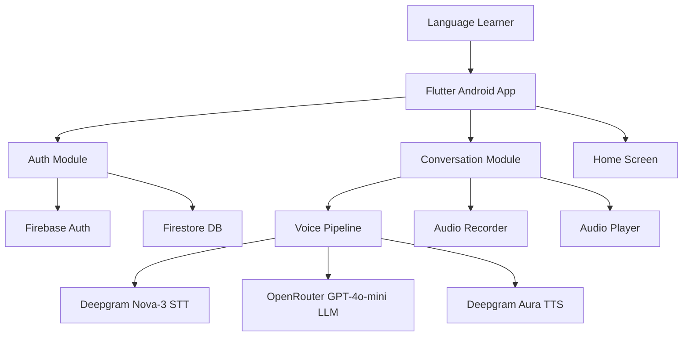
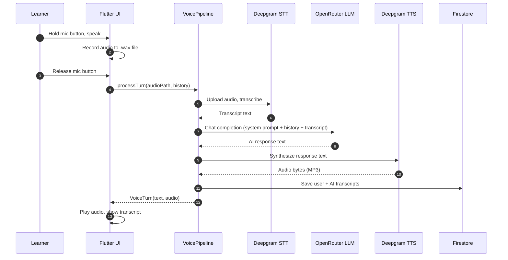

# Olympus Language AI — Architecture

Generated: `2026-08-06`
From: Flutter Android project, Phase 1 codebase.

> Project identity: **Olympus Language AI** — Voice-first language learning app with an AI conversation partner, built with Flutter, Firebase, Deepgram, and OpenRouter.

## 1. Component Architecture



## 2. Data Flow — Voice Pipeline



## 3. Module Layout

```
lib/
  core/
    firebase/
      firebase_config.dart          — Firebase init + singleton instances
      firestore_service.dart        — Typed CRUD for users/sessions/transcripts
    router/
      app_router.dart               — GoRouter config with auth guards
    voice/
      deepgram_stt_service.dart     — Nova-3 transcription API
      deepgram_tts_service.dart     — Aura speech synthesis API
      openrouter_service.dart       — GPT-4o-mini chat completion API
      voice_pipeline.dart           — Orchestrator: STT → LLM → TTS
  features/
    auth/
      domain/auth_state.dart        — Sealed union: Authenticated/Unauthenticated/Loading
      data/auth_repository.dart     — Firebase Auth + Google Sign-In
      presentation/auth_notifier.dart — StateNotifier for auth lifecycle
      presentation/providers.dart   — Riverpod providers
      presentation/screens/         — LoginScreen, SignupScreen
    conversation/
      domain/models.dart            — ChatMessage, Session
      domain/conversation_state.dart — Sealed: Idle/Recording/Processing/Speaking/Error
      data/conversation_repository.dart — Session + transcript persistence
      presentation/conversation_notifier.dart — Pipeline state machine
      presentation/providers.dart   — Riverpod providers
      presentation/screens/         — ConversationScreen
    home/
      presentation/screens/         — HomeScreen
```

## 4. Firestore Schema

```
/users/{uid}
  email, displayName, createdAt, plan, totalMinutesUsed, currentStreak, lastActiveDate

/sessions/{sessionId}
  userId, startedAt, endedAt, durationSeconds, transcriptCount, scenarioId

/transcripts/{transcriptId}
  sessionId, userId, speaker, text, audioUrl, timestamp, correction
```

## 5. External Dependencies

- **Deepgram API** — STT (Nova-3) + TTS (Aura Asteria)
- **OpenRouter API** — GPT-4o-mini chat completions
- **Firebase** — Auth (email + Google), Firestore (NoSQL database)
- **Flutter Packages** — riverpod, go_router, record, audioplayers, http, flutter_dotenv

## 6. Operational Notes

- Entry point: `flutter run` (Android device or emulator)
- API keys required in `.env` (gitignored)
- Firebase config via `google-services.json` in `android/app/`
- minSdk 24 (Android 7.0+)
